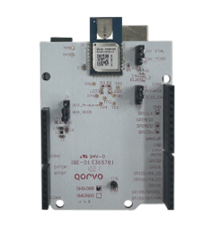
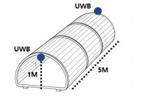
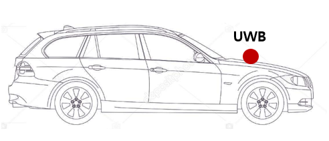
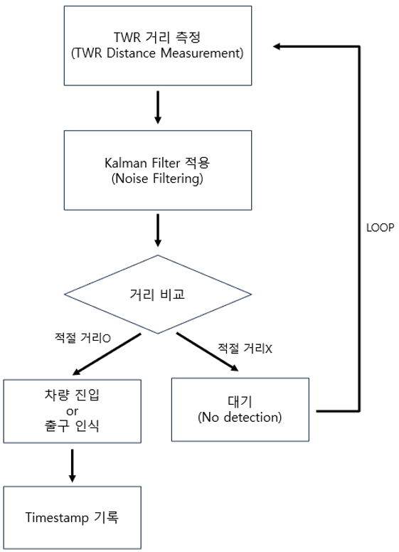
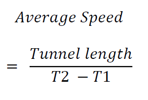
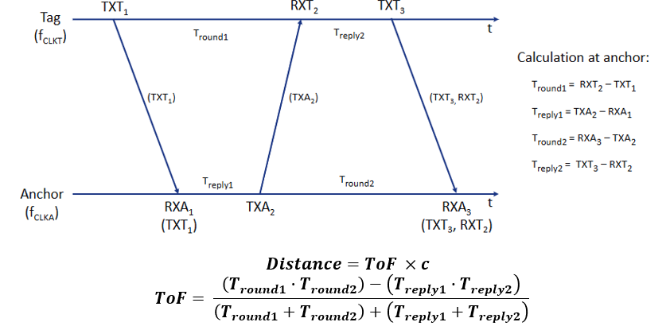
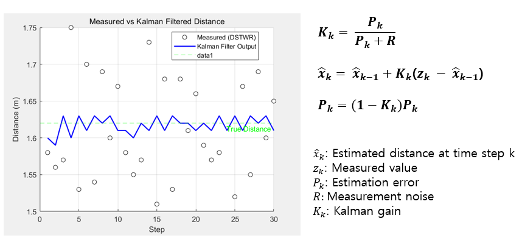
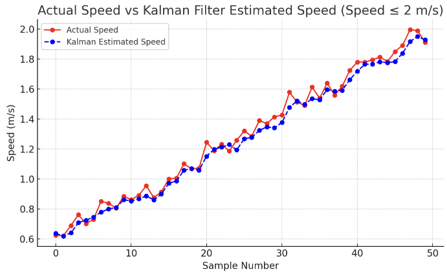

# 🚘 Development of a UWB DS-TWR-Based Tunnel Vehicle Over-Speed Detection System

> A low-cost, high-accuracy tunnel speed enforcement system using UWB and Kalman Filter.

---

## 📌 1. Introduction

Conventional tunnel speed enforcement systems use ANPR cameras, which are expensive and sensitive to environmental changes.

This project proposes a UWB (Ultra-Wideband)-based system using **DS-TWR (Double-Sided Two-Way Ranging)** and **Kalman Filter** for accurate, real-time speed detection.

---

## 🌐 2. Environment & Setup

  
- UWB Module: **Decawave DWM1000**

- Tunnel Length: **5 meters**
- Tunnel Height: **1 meter**
- Anchor placement: entrance & exit  

- Tag placement: front of the vehicle

---

## 🔁 3. Process Overview

---

## 📐 4. Methods

### ✅ Average Speed Formula

- T1: Entry timestamp  
- T2: Exit timestamp

---

### 🛰️ DS-TWR (Double-Sided Two-Way Ranging)

DS-TWR uses three message exchanges to calculate **Time of Flight (ToF)** and estimate distance precisely:

---

### 🔧 Kalman Filter

Used to reduce noise from UWB measurements and improve real-time estimation:

Where:
- x̂k: Estimated distance at time step k  
- zk: Measured value (DS-TWR)  
- Pk: Estimation error  
- R: Measurement noise  
- Kk: Kalman gain  

---

## 📊 5. Results

### ✅ Accuracy Table

| Trial | Real Speed (m/s) | Measured Speed (m/s) | Error Rate | Over-speed |
|-------|------------------|----------------------|------------|------------|
| 1     | 1.51             | 1.55                 | 1.65%      | ✅ Yes     |
| 2     | 1.84             | 1.78                 | 3.26%      | ✅ Yes     |
| 3     | 1.85             | 1.78                 | 3.78%      | ✅ Yes     |
| 4     | 1.58             | 1.65                 | 4.43%      | ✅ Yes     |
| 5     | 0.77             | 0.75                 | 2.67%      | ❌ No      |
| 6     | 0.66             | 0.68                 | 3.33%      | ❌ No      |
| 7     | 0.83             | 0.85                 | 2.40%      | ❌ No      |

### 📈 Kalman Filter vs Raw Measurements

---

## 🧠 Conclusion & Effects

- 📉 **Low-cost** and **privacy-respecting** alternative to ANPR
- 🛠 **Accurate even in dark / non-visible environments**
- 🔍 Can be extended to predict routes or detect abnormal driving

---

## 👨‍🏫 Project Info

- **Team**: LEETAEBOK
- **Advisor**: Prof. Jang Byeong-Jun  
- **University**: Kookmin University – Dept. of Electronic Engineering

---

## 📎 Keywords

`UWB` `DS-TWR` `Kalman Filter` `Tunnel` `Over-Speed Detection` `Embedded Systems`
